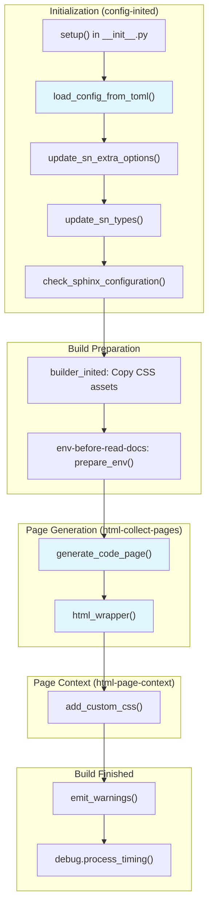

# AGENTS.md

This file provides guidance for AI coding agents working on the **sphinx-codelinks** repository.

## Project Overview

sphinx-codelinks is a Sphinx extension that provides fast source code traceability for Sphinx-Needs. It enables:

- **Code analysis**: Scan source code files (C++, Python, C#, Rust, YAML) for special comment markers
- **Automatic documentation generation**: Create Sphinx-Needs items from discovered code markers
- **Source tracing**: Link documentation to exact source code locations with line numbers
- **Multiple languages**: Support for various programming languages via tree-sitter parsers
- **CLI interface**: Command-line tools for analyzing code and generating RST documentation

The project integrates with [Sphinx-Needs](https://sphinx-needs.readthedocs.io/) to provide seamless source code traceability in technical documentation.

## Repository Structure

```text
pyproject.toml          # Project configuration and dependencies
tox.ini                 # Tox test environment configuration
README.md               # Project README
LICENSE                 # MIT License

src/sphinx_codelinks/   # Main source code
├── __init__.py         # Package init with Sphinx setup() entry point
├── cmd.py              # CLI commands using Typer
├── config.py           # Configuration models using Pydantic
├── logger.py           # Logging utilities
├── needextend_write.py # Write RST files with Sphinx-Needs directives
├── analyse/            # Code analysis module
│   ├── analyse.py      # Main analysis orchestration
│   ├── models.py       # Pydantic models for analysis results
│   ├── oneline_parser.py # One-line comment parser
│   ├── projects.py     # Project-specific analyzers (C++, Python, etc.)
│   └── utils.py        # Analysis utilities
├── source_discover/    # Source file discovery
│   ├── config.py       # Discovery configuration
│   └── source_discover.py # File discovery logic
└── sphinx_extension/   # Sphinx extension components
    ├── source_tracing.py # Main Sphinx extension setup
    ├── html_wrapper.py  # HTML output wrapper for traced source
    ├── debug.py         # Debug utilities
    ├── ub_sct.css       # CSS for source tracing UI
    └── directives/      # Custom Sphinx directives

tests/                  # Test suite
├── __init__.py
├── conftest.py         # Pytest fixtures and configuration
├── test_analyse.py     # Analysis tests
├── test_*.py           # Various test modules
├── __snapshots__/      # Syrupy snapshot test fixtures
└── data/               # Test data and fixtures

docs/                   # Documentation source (RST)
├── conf.py             # Sphinx configuration
├── source/
│   ├── index.rst       # Documentation index
│   ├── basics/         # Basic usage documentation
│   ├── components/     # Component documentation
│   └── development/    # Development documentation
```

## Development Commands

All commands should be run via [`tox`](https://tox.wiki) for consistency. The project uses `tox-uv` for faster environment creation.

### Testing

```bash
# Run default test environment
tox

# Run tests for specific Python/Sphinx combination
tox -e py312-sphinx8

# Run a specific test file
tox -e py312-sphinx8 -- tests/test_analyse.py

# Run a specific test function
tox -e py312-sphinx8 -- tests/test_analyse.py::test_function_name

# Run with coverage
tox -e py312-sphinx8 -- --cov=sphinx_codelinks

# Update snapshot test fixtures
tox -e py312-sphinx8 -- --snapshot-update
```

### Documentation

```bash
# Build docs (clean)
tox -e docs-clean

# Build docs (incremental, after clean build)
tox -e docs-update

# Build with different builder (e.g., linkcheck)
BUILDER=linkcheck tox -e docs-clean

# Live rebuild with browser auto-reload
tox -e docs-live
```

### Code Quality

```bash
# Type checking with mypy
tox -e mypy

# Linting with ruff (check only)
tox -e ruff-check

# Auto-format with ruff
tox -e ruff-fmt

# Run pre-commit hooks on all files
pre-commit run --all-files
```

## Code Style Guidelines

- **Formatter/Linter**: Ruff (configured in `pyproject.toml`)
- **Type Checking**: Mypy with strict settings (configured in `pyproject.toml`)
- **Markdown**: Follow markdownlint rules for consistent and well-formatted Markdown files
- **Pre-commit**: Use pre-commit hooks for consistent code style

### Best Practices

- **Type annotations**: Use complete type annotations for all function signatures. Use Pydantic models for configuration and data structures.
- **Docstrings**: Use Sphinx-style docstrings (`:param:`, `:return:`, `:raises:`). Types are not required in docstrings as they should be in type hints.
- **Markdown formatting**: Write clear, well-structured Markdown that adheres to markdownlint rules. Use proper headings, lists, and code blocks.
- **Immutability**: Prefer immutable data structures where possible. Use frozen Pydantic models for configuration.
- **Pure functions**: Where possible, write pure functions without side effects.
- **Error handling**: Raise descriptive exceptions with helpful error messages. Use custom exception types where appropriate.
- **Testing**: Write tests for all new functionality. Use syrupy for snapshot testing of complex outputs.

### Docstring Example

```python
def discover_source_files(
    root_dir: Path,
    include_patterns: list[str],
    exclude_patterns: list[str],
    *,
    respect_gitignore: bool = True,
) -> list[Path]:
    """Discover source files matching the given patterns.

    :param root_dir: The root directory to search from.
    :param include_patterns: Glob patterns for files to include.
    :param exclude_patterns: Glob patterns for files to exclude.
    :param respect_gitignore: Whether to respect .gitignore rules.
    :return: List of discovered file paths.
    :raises ValueError: If root_dir does not exist.
    """
    ...
```

## Testing Guidelines

### Test Structure

- Tests use `pytest` with fixtures from `conftest.py`
- Snapshot testing uses `syrupy` for complex output comparisons
- Test data is in `tests/data/` directory
- Sphinx integration tests use actual Sphinx projects in `tests/doc_test/`

### Writing Tests

1. For code analysis tests, create test data in `tests/data/` with source files
2. Use `syrupy` for comparing complex analysis outputs (JSON, doctrees, etc.)
3. For Sphinx integration, create minimal projects in `tests/doc_test/`
4. Use parametrized tests for testing multiple language parsers

### Test Best Practices

- **Test coverage**: Write tests for all new functionality and bug fixes
- **Isolation**: Each test should be independent and not rely on state from other tests
- **Descriptive names**: Test function names should describe what is being tested
- **Snapshot testing**: Use `snapshot.assert_match()` for complex output comparisons
- **Parametrization**: Use `@pytest.mark.parametrize` for multiple test scenarios
- **Fixtures**: Define reusable fixtures in `conftest.py`

### Example Test Pattern

```python
import pytest
from pathlib import Path

def test_analyse_cpp_file(snapshot, tmp_path):
    """Test C++ file analysis produces correct output."""
    # Arrange
    source_file = tmp_path / "test.cpp"
    source_file.write_text("""
    // @req{REQ-001}
    void function() {}
    """)

    # Act
    result = analyse_file(source_file)

    # Assert
    assert snapshot == result
```

## Commit Message Format

Use this format:

```text
<EMOJI> <KEYWORD>: Summarize in 72 chars or less (#<PR>)

Optional detailed explanation.
```

Keywords:

- `✨ NEW:` – New feature
- `🐛 FIX:` – Bug fix
- `👌 IMPROVE:` – Improvement (no breaking changes)
- `‼️ BREAKING:` – Breaking change
- `📚 DOCS:` – Documentation
- `🔧 MAINTAIN:` – Maintenance changes only (typos, etc.)
- `🧪 TEST:` – Tests or CI changes only
- `♻️ REFACTOR:` – Refactoring

## PR Title and Description Format

Use the same as for the commit message format,
but for the title you can omit the `KEYWORD` and only use `EMOJI`

## Pull Request Requirements

When submitting changes:

1. **Description**: Include a meaningful description or link explaining the change
2. **Tests**: Include test cases for new functionality or bug fixes
3. **Documentation**: Update docs if behavior changes or new features are added
4. **Changelog**: Update relevant changelog or release notes
5. **Code Quality**: Ensure `pre-commit run --all-files` passes

## Architecture Overview

### Analysis Pipeline

The code analysis follows a multi-stage pipeline:

```text
Source Files → Discovery → Parsing → Analysis → Results (JSON) → RST Generation
```

1. **Discovery** (`source_discover/`): Scan directories for source files matching patterns
2. **Parsing** (`analyse/oneline_parser.py`): Use tree-sitter to parse source code AST
3. **Analysis** (`analyse/analyse.py`, `analyse/projects.py`): Extract markers and metadata
4. **Output** (`needextend_write.py`): Generate RST with Sphinx-Needs directives

### Sphinx Integration Flow

The Sphinx extension hooks into multiple build events to provide source tracing:



#### Event Handlers

The extension connects to these Sphinx events (in execution order):

| Event                  | Handler                        | Purpose                                                              |
| ---------------------- | ------------------------------ | -------------------------------------------------------------------- |
| `config-inited`        | `load_config_from_toml()`      | Load configuration from TOML file if specified                       |
| `config-inited`        | `update_sn_extra_options()`    | Register sphinx-needs extra options (project, file, directory, URLs) |
| `config-inited`        | `update_sn_types()`            | Add `srctrace` need type to sphinx-needs                             |
| `config-inited`        | `check_sphinx_configuration()` | Validate configuration and raise errors                              |
| `builder-inited`       | `builder_inited()`             | Copy CSS assets to output directory                                  |
| `env-before-read-docs` | `prepare_env()`                | Initialize timing measurements and debug filters                     |
| `html-collect-pages`   | `generate_code_page()`         | Generate HTML pages for traced source files                          |
| `html-page-context`    | `add_custom_css()`             | Inject custom CSS for source tracing UI                              |
| `build-finished`       | `emit_warnings()`              | Emit collected warnings from analysis                                |
| `build-finished`       | `debug.process_timing()`       | Output timing measurements if enabled                                |

#### Key Integration Points

1. **sphinx-needs Dependency**: The extension requires sphinx-needs and checks for its presence in `setup()`. It adds extra options (`project`, `file`, `directory`, URL fields) and a custom need type (`srctrace`).

2. **TOML Configuration**: Configuration can be loaded from a TOML file specified in `conf.py` via `src_trace_config_from_toml`. The TOML is parsed and values are set on the Sphinx config object.

3. **Source Page Generation**: The `generate_code_page()` function yields tuples of `(pagename, context, template)` for each traced source file, allowing Sphinx to generate standalone HTML pages with syntax-highlighted source code and line-number anchors.

4. **CSS Injection**: Custom CSS (`ub_sct.css`) is copied to `_static/source_tracing/` and added only to pages that contain traced source code.

### Key Components

#### Configuration (`config.py`)

Pydantic models define all configuration options:

- `AnalyseConfig`: Main analysis configuration with source paths, patterns, markers
- Uses Pydantic v2 with validation and serialization
- Configuration loaded from TOML files

#### Source Discovery (`source_discover/`)

- `discover_source_files()`: Find source files matching include/exclude patterns
- Respects `.gitignore` rules using `gitignore-parser`
- Returns filtered list of files to analyze

#### Code Analysis (`analyse/`)

- **`analyse.py`**: Main orchestrator that coordinates analysis across all source files
- **`projects.py`**: Language-specific analyzers (C++, Python, C#, Rust, YAML)
- **`oneline_parser.py`**: Tree-sitter based parser for extracting comment markers
- **`models.py`**: Pydantic models for analysis results (markers, line ranges, etc.)
- **`utils.py`**: Helper functions for path handling, marker extraction

#### Tree-sitter Integration

- Uses tree-sitter parsers for each supported language
- Extracts comments from AST nodes
- Parses special marker syntax (e.g., `@req{ID}`, `@test{ID}`)
- Maintains line number information for source tracing

#### Sphinx Extension (`sphinx_extension/`)

- **`source_tracing.py`**: Main extension setup with `setup()` function
- **`html_wrapper.py`**: Wraps source code blocks with tracing metadata
- **`debug.py`**: Debug utilities for development
- Hooks into Sphinx build events to inject source tracing information

### CLI Interface

The CLI uses Typer for command definitions:

- `codelinks analyse <config>`: Analyze source code and output JSON
- `codelinks write <format> <input> --outpath <file>`: Generate RST from JSON

## Key Files

- `pyproject.toml` - Project configuration, dependencies, and tool settings
- `src/sphinx_codelinks/__init__.py` - Package entry point with `setup()` for Sphinx
- `src/sphinx_codelinks/cmd.py` - CLI commands and argument parsing
- `src/sphinx_codelinks/config.py` - Pydantic configuration models
- `src/sphinx_codelinks/analyse/analyse.py` - Main analysis orchestration
- `src/sphinx_codelinks/analyse/projects.py` - Language-specific analyzers
- `src/sphinx_codelinks/analyse/oneline_parser.py` - Tree-sitter comment parser
- `src/sphinx_codelinks/sphinx_extension/source_tracing.py` - Sphinx extension setup
- `tests/conftest.py` - Pytest fixtures and test configuration

## Debugging

- Use `--pdb` with pytest to drop into debugger on failures: `tox -e py312-sphinx8 -- --pdb`
- Use `-v` for verbose test output: `tox -e py312-sphinx8 -- -v`
- Build docs with `-T` flag for full tracebacks: `tox -e docs-clean -- -T`
- Set logging level in tests: `tox -e py312-sphinx8 -- --log-cli-level=DEBUG`
- Use `debug.py` module functions for development debugging

## Common Patterns

### Adding Support for a New Language

1. Add tree-sitter parser dependency to `pyproject.toml` (e.g., `tree-sitter-java`)
2. Create language-specific analyzer in `analyse/projects.py`:

   ```python
   class JavaAnalyzer(BaseAnalyzer):
       language = "java"
       parser_language = "java"

       def get_comment_nodes(self, tree):
           # Return comment nodes from tree
   ```

3. Register analyzer in `LANGUAGE_ANALYZERS` dict in `projects.py`
4. Add test files in `tests/data/<language>/`
5. Add tests in `tests/test_analyse.py`

### Adding a New Marker Type

1. Update marker regex patterns in `config.py` or analyzer
2. Update `models.py` if new fields are needed
3. Update parsing logic in `oneline_parser.py`
4. Update RST generation in `needextend_write.py` if needed
5. Add tests with new marker examples

### Adding a CLI Command

1. Add command function in `cmd.py` using Typer decorators:

   ```python
   @app.command()
   def new_command(arg: str = typer.Argument(..., help="Description")):
       """Command description."""
       # Implementation
   ```

2. Add tests in `tests/test_cmd.py`
3. Update documentation in `docs/source/components/cli.rst`

### Adding Configuration Options

1. Add field to `AnalyseConfig` or relevant Pydantic model in `config.py`
2. Add validation if needed using Pydantic validators
3. Update TOML configuration examples in `docs/` and `tests/data/configs/`
4. Add tests for new configuration option
5. Document in `docs/source/components/configuration.rst`

## Reference Documentation

- [Sphinx Documentation](https://www.sphinx-doc.org/) · [Repository](https://github.com/sphinx-doc/sphinx)
- [Sphinx-Needs Documentation](https://sphinx-needs.readthedocs.io/) · [Repository](https://github.com/useblocks/sphinx-needs)
- [tree-sitter Documentation](https://tree-sitter.github.io/tree-sitter/) · [Repository](https://github.com/tree-sitter/tree-sitter)
- [Pydantic Documentation](https://docs.pydantic.dev/) · [Repository](https://github.com/pydantic/pydantic)
- [pytest Documentation](https://docs.pytest.org/) · [Repository](https://github.com/pytest-dev/pytest)
- [Typer Documentation](https://typer.tiangolo.com/) · [Repository](https://github.com/fastapi/typer)
