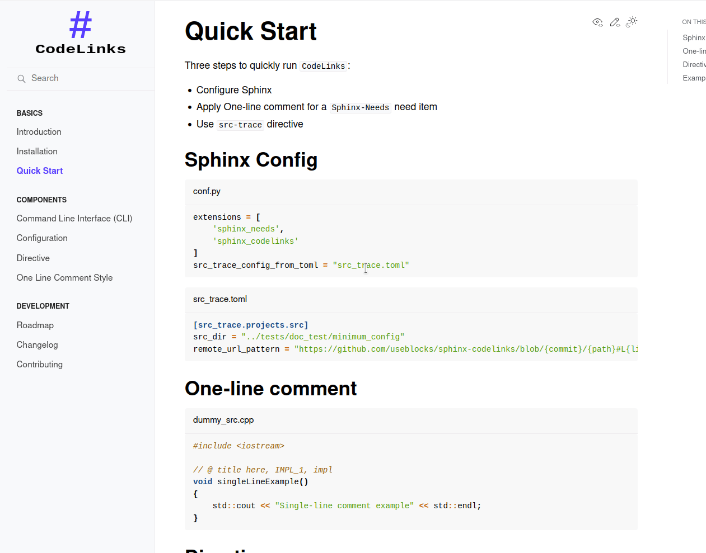

Quick Start
===========

Three steps to quickly run ``CodeLinks`` to achieve **the above**:

- Configure Sphinx
- Apply One-line comment for a ``Sphinx-Needs`` need item
- Use ``src-trace`` directive

Sphinx Config
-------------

.. code-block:: python
   :caption: conf.py

   extensions = [
       'sphinx_needs',
       'sphinx_codelinks'
   ]
   src_trace_config_from_toml = "src_trace.toml"

.. literalinclude:: ./../../src_trace.toml
   :caption: src_trace.toml
   :language: toml
   :lines: 27-29

One-line comment
----------------

.. literalinclude:: ./../../../tests/doc_test/minimum_config/dummy_src.cpp
   :caption: dummy_src.cpp
   :language: cpp

Directive
---------

.. literalinclude:: ./../../../tests/doc_test/minimum_config/index.rst
   :caption: index.rst
   :language: rst

Example
-------

.. src-trace:: dummy src
   :project: src

.. note:: **local-url** is not working on the website as it only supports local browse

Section :ref:`Directive <directive>` provides more adavanced usage.
